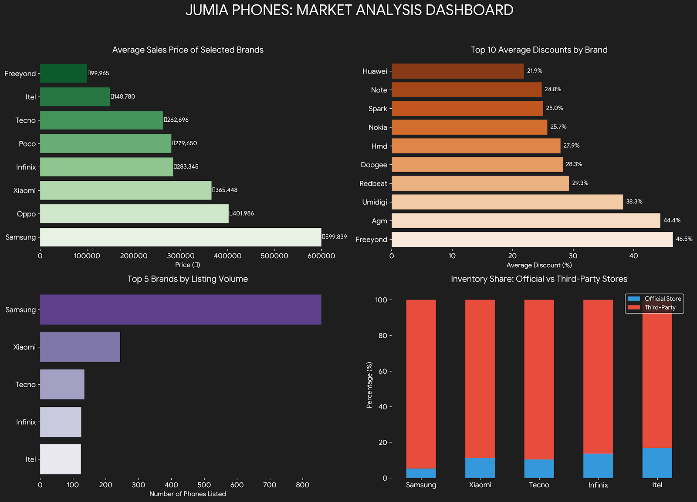

# Jumia Nigeria Smartphone Market Analysis

I built this project to collect smartphone listings from Jumia Nigeria and use them for a practical market analysis.

It started as a web-scraping and EDA project, but while reviewing it I found several problems in the original data — especially with review counts, product links, duplicate listings and non-phone products appearing in the category. I rebuilt the project so that the cleaning, validation and analysis steps are easier to follow and reproduce.



## What I worked with

The original scrape contained **1,960 listings**.

After checking the product names, I found **52 obvious non-phone listings** such as tablets, headphones, calculators and accessories. I flagged those out of the smartphone analysis, leaving **1,908 smartphone listings**.

One important thing about this dataset:

> It contains product listings, not sales transactions.

That means I can analyze things such as prices, listing presence, discounts and seller type, but I cannot use it to claim actual units sold, revenue or Nigerian smartphone market share.

## What I found

A few results stood out:

- **Samsung makes up 44.2% of the smartphone listings** in the dataset.
- The top five brands — Samsung, Xiaomi, Tecno, Infinix and Itel — make up about **76.9%** of all smartphone listings.
- The overall **median advertised price is ₦290,000**.
- The largest price group is the **₦150,000–₦300,000 range**, which contains about **31.6%** of listings.
- Only about **8.3%** of listings are marked as official-store products.
- About **60.6%** of listings show a discount compared with the displayed old price.
- Among discounted listings, the median discount is about **18.1%**.
- Only **33.3%** of listings have usable rating/review information.
- About **19.1%** of rows belong to a product title that appears more than once.

A more detailed write-up is available in [reports/analysis_findings.md](reports/analysis_findings.md).

## Brand price differences

The median advertised prices also show how differently the brands are positioned in this snapshot:

| Brand | Median advertised price |
|---|---:|
| Itel | ₦128,999 |
| Tecno | ₦179,999 |
| Infinix | ₦185,000 |
| Xiaomi | ₦219,999 |
| Samsung | ₦385,000 |
| Google | ₦1,340,000 |
| Apple | ₦2,650,000 |

These are listing prices from the scraped data, not average selling prices.

## A data problem I had to fix

The original scraper captured the rating and review count together.

For example:

```text
4.1 out of 5861
```

At first glance, that can look like 5,861 reviews.

But the actual meaning is:

```text
rating = 4.1 out of 5
review_count = 861
```

I updated the parser to separate the fixed `out of 5` part from the review count and added tests for cases like this.

I also found that many of the old product URLs were either blank or pointed to Jumia's login page rather than the product itself. Instead of treating those as valid links, the cleaning step now marks them as missing.

## Project workflow

```text
Jumia listings
      ↓
Python scraper
      ↓
Raw CSV
      ↓
Cleaning and normalization
      ↓
Data-quality checks
      ↓
Processed dataset
      ↓
Python analysis + SQL + dashboard
```

## Project structure

```text
src/
  scraper.py
  cleaning.py
  validate.py
  pipeline.py
  analysis.py
  build_sqlite.py
  build_dashboard.py

notebooks/
  market_analysis.ipynb

sql/
  analysis_queries.sql

dashboard/
  jumia_market_dashboard.html

reports/
  analysis_findings.md

docs/
  data_dictionary.md
  methodology.md

tests/
  test_cleaning.py
```

The older notebook and files are still in the repository for project history, but the folders above contain the cleaned-up version of the project.

## Data checks

The processing pipeline now checks the main fields before analysis.

| Check | Result |
|---|---|
| Rows processed | Pass |
| Numeric price coverage | 99.8% |
| Rating values within 0–5 | Pass |
| Review counts non-negative | Pass |
| Discounts within valid range | Pass |
| Brand coverage | 100% |
| Cleaning/parser tests | 6 passed |

## Official store vs third-party listings

Third-party sellers make up about **91.7%** of the smartphone listings in this snapshot.

Rating information is available for around **77.2%** of official-store listings compared with **29.4%** of third-party listings.

I treat this as a descriptive difference only. The two groups contain different brands and products, so it would be misleading to claim that being an official store causes better ratings or more reviews.

## Tools used

- Python
- Pandas
- NumPy
- Requests
- BeautifulSoup
- Matplotlib
- SQLite / SQL
- Pytest
- Git and GitHub

## How to run it

Install the requirements:

```bash
pip install -r requirements.txt
```

Run the tests:

```bash
python -m pytest -q
```

Process the historical dataset:

```bash
PYTHONPATH=src python src/pipeline.py
```

Build the SQLite database:

```bash
PYTHONPATH=src python src/build_sqlite.py
```

The SQL queries are in:

```text
sql/analysis_queries.sql
```

Build the HTML dashboard:

```bash
PYTHONPATH=src python src/build_dashboard.py
```

Then open:

```text
dashboard/jumia_market_dashboard.html
```

A fresh scrape can be run with:

```bash
python src/scraper.py --pages 50 --delay 1
```

Because websites change over time, the scraper selectors may need to be updated if Jumia changes its page structure.

## Limitations

There are a few things I would not use this dataset to claim:

- actual sales volume;
- revenue;
- inventory levels;
- conversion rates;
- national smartphone market share.

The dataset is also a single snapshot, so it cannot show how prices or product availability changed over time.

Rating/review data is incomplete, and the historical product URLs were not captured correctly.

I kept repeated product titles in the dataset and flagged them instead of automatically deleting them because the same title may represent different sellers or offers.

## What this project shows

For me, the main value of this project is that it goes beyond making charts from a ready-made CSV.

I had to collect the data, find problems in the original scrape, clean and validate the fields, decide what should and should not be included in the analysis, query the data with SQL and then present the results in a dashboard.

A useful future extension would be to collect new snapshots over time so I could compare price changes and see which models enter or leave the marketplace.
